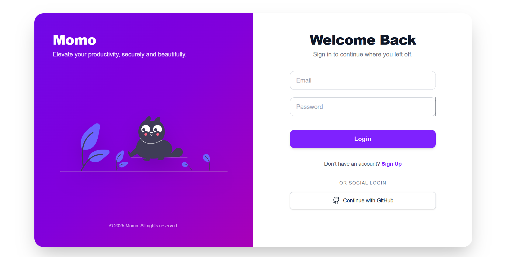

<div align="center">
  <a href="https://momo-task.vercel.app" target="_blank">
    
  </a>
  <h1>Momo</h1>
</div>

<p align="center">
  <a href="#project-description">Project Description</a> &nbsp;|&nbsp; 
  <a href="#branches">Branches</a> &nbsp;|&nbsp;
  <a href="#key-components">Key Components</a> &nbsp;|&nbsp; 
  <a href="#key-features">Key Features</a> &nbsp;|&nbsp; 
  <a href="#tech-stack">Tech Stack</a> &nbsp;|&nbsp; 
  <a href="#installation">Installation</a> &nbsp;|&nbsp;
  <a href="#usage">Usage</a>
</p>



---

## Project Description

**Momo** is a task management app that helps you organize tasks efficiently.  
It supports **tasks, notes, and todos**, and categorizes them into **daily, weekly, and upcoming views**.  
Users can manage subtasks, add notes, and track deadlines in a clean, responsive interface.

Built with a **hybrid SSR + CSR** architecture using **Next.js** for optimal performance and SEO.

---

## Branches

- 🌐 **A – Frontend Only**  
  Implements the UI and task interactions using React, TypeScript, and TailwindCSS.  
  🔗 [Live Demo](https://github.com/nca-gabriel/Momo)

- 🖥️ **B – Backend / Master**  
  Adds database persistence for tasks, notes, and todos using Prisma, MongoDB, Zod, React Hook Form, and NextAuth for authentication.  
  ⚡ Follow the [Installation](#installation) instructions to run locally.

---

## Key Components

- **App.tsx / Layout** – main container handling routing and page layouts.  
- **TagTodosClient** – displays tasks filtered by tag with initial server-side data (SSR + CSR).  
- **TodoForm / NoteForm** – manage creation and editing of tasks, notes, and subtasks.  
- **Hooks** – `useTodos`, `useTags` for state management and React Query fetching.  
- **Utils / Zod Schemas** – validation and type safety for tasks, todos, and notes.  

---

## Key Features

- 📅 **Task Categorization** – daily, weekly, and upcoming views for easy tracking.  
- 📝 **Notes & Todos** – add notes and subtasks under tasks.  
- 🔐 **User Authentication** – login/signup with NextAuth.  
- 📋 **Persistent Storage** – Prisma + MongoDB backend for all tasks and notes.  
- 🎨 **Responsive UI** – clean design built with TailwindCSS.  
- ⚡ **Fast & Type-Safe** – TypeScript + Zod for reliability and maintainability.  
- 🔄 **Hybrid Rendering** – SSR for SEO + CSR for fast user interactions.  
- 🍞 **Realtime Feedback** – React Hot Toast notifications for smooth UX.  

---

## Tech Stack

**Framework:** Next.js (SSR + CSR hybrid)  
**Frontend:** React, TypeScript, TailwindCSS  
**Backend:** Prisma, MongoDB, Zod  
**Forms & Validation:** React Hook Form  
**State & Fetching:** React Query  
**Authentication:** NextAuth  
**Notifications:** React Hot Toast  

---

## Installation

```bash
git clone https://github.com/nca-gabriel/Momo.git
cd Momo
npm install
```


## Usage

Start the development server:

```bash
npm run dev
```


